 
Это документация к прототипу решения задачи "Мобильное приложение  для образования в сфере искусства" хакатона "Лидеры цифровой трансформации" 2023

*Краткое руководство* описано чуть ниже  
*Контент-менеджерам* и *администраторам* будет интересен раздел [Руководство](manual.md)  
Для *технических специалистов* представлен раздел [Техническая документация](tech.md)  

# Презентация решения
С презентацией решения можно ознакомиться [здесь](https://disk.yandex.ru/d/cgqwC5OehWgy3g)  
APK, дамп БД и учетные записи для системы управления контентом вместе с [презентацией](https://disk.yandex.ru/d/cgqwC5OehWgy3g)

# Краткое руководство пользователя

## Вход и регистрация
При первом запуске приложения вам необходимо зарегистрироваться
### Регистрация через почту  
- укажите почту и придумайте пароль  
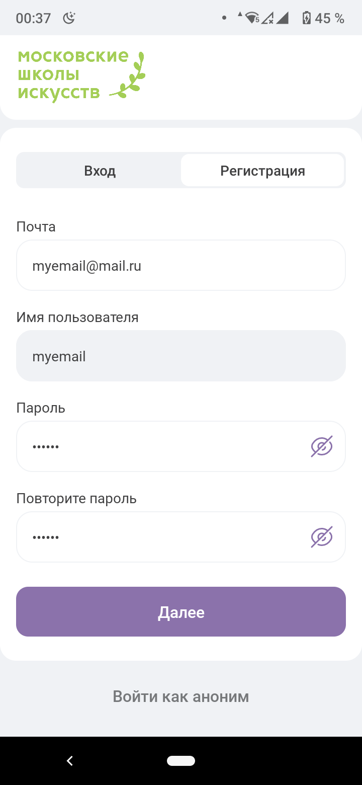  
- заполните имя, фамилию и дату рождения  
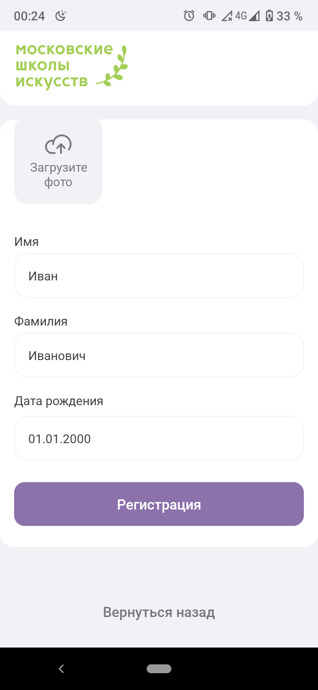  
- нажмите "Регистрация"
### Вход через почту
- введите почту и пароль, с которыми зарегистрировались ранее  
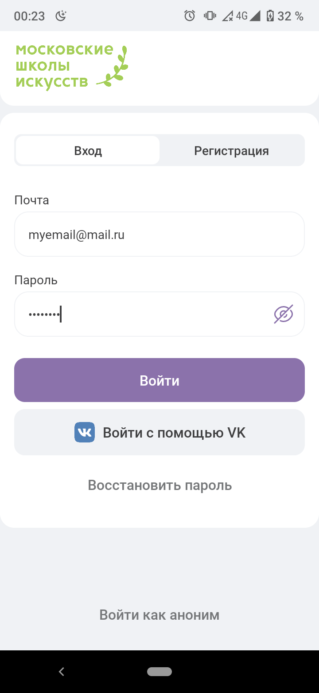  
- нажмите "Войти"  

### Вход через ВКонтакте
- нажмите "Войти с помощью VK"   
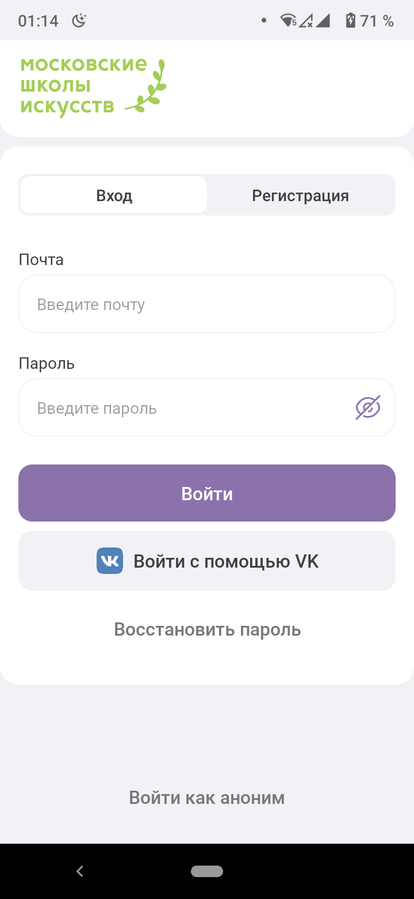  
- войдите в учетную запись VK, а затем нажмите "Войти через VK ID"  
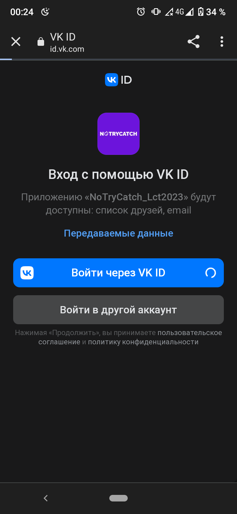  

## Прохождение заданий
- перейдите в раздел "Задания" в меню приложения и выберите задание  
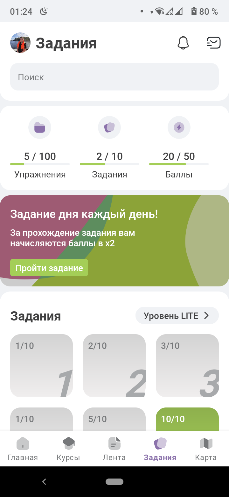  
- в текстовом задании необходимо выбрать правильный вариант из 4х предложенных  
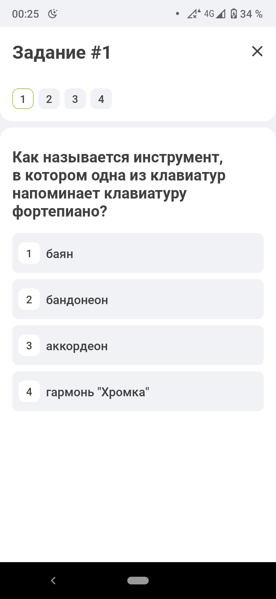 
- правильный ответ будет подсвечен зеленым цветом  
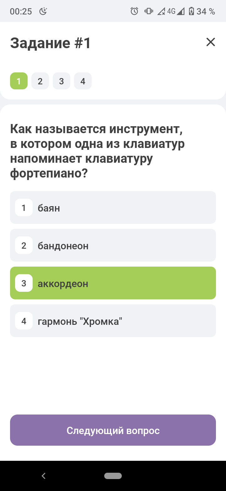  
- если ответ неправильный - ваш выбор будет подсвечен красным цветом  
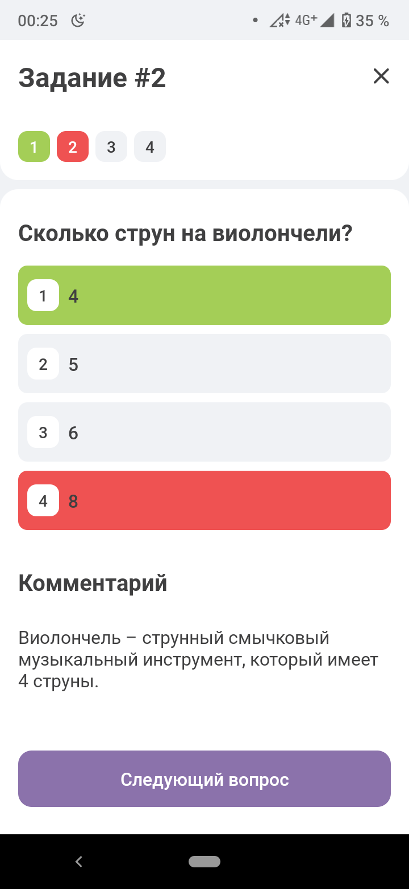  

- в заданиях с аудио ответами необходимо выбрать подходящее аудио к предложенному видео, чтобы обозначить ответ необходимо нажать кнопку "Выбрать" во время проигрывания аудио   
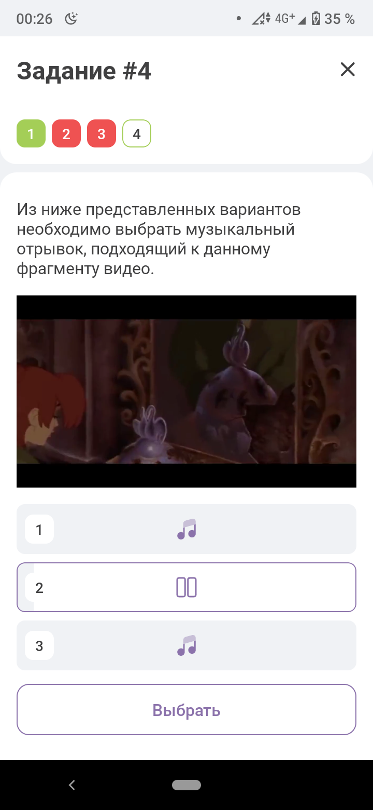   

## Карта школ и мероприятий
- перейдите в раздел "Карта" в меню приложения  
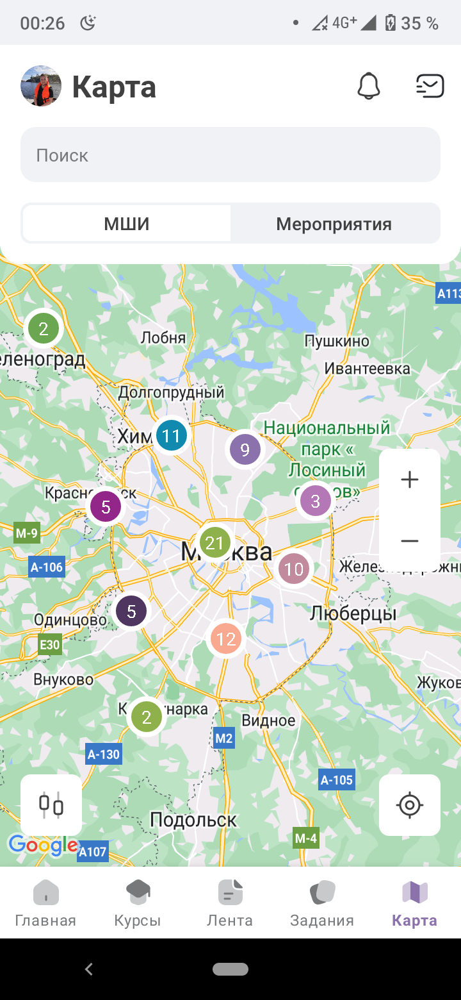  
- воспользуйтесь фильтром для поиска направления или воспользуйтесь полем "поиск"  
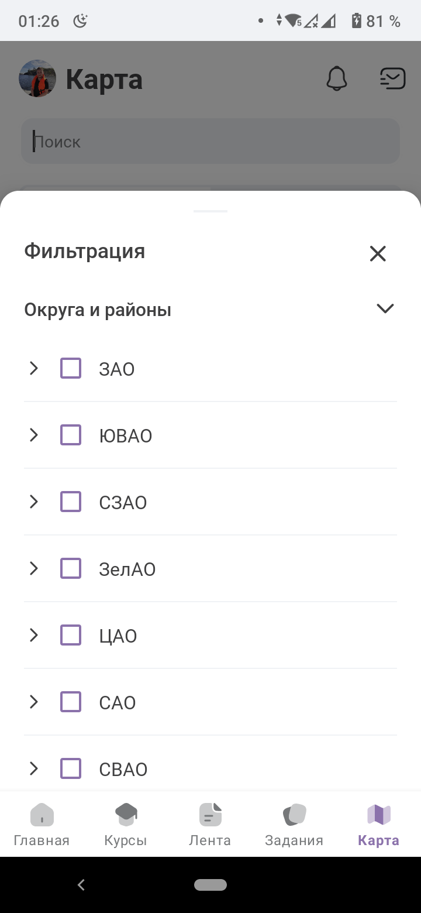
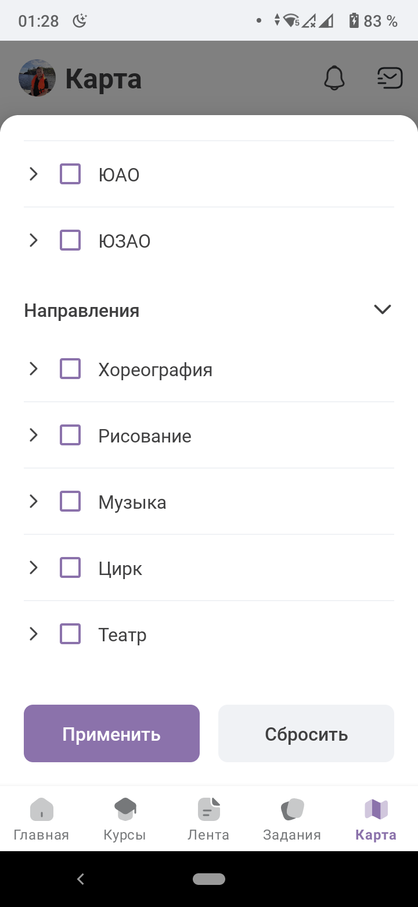
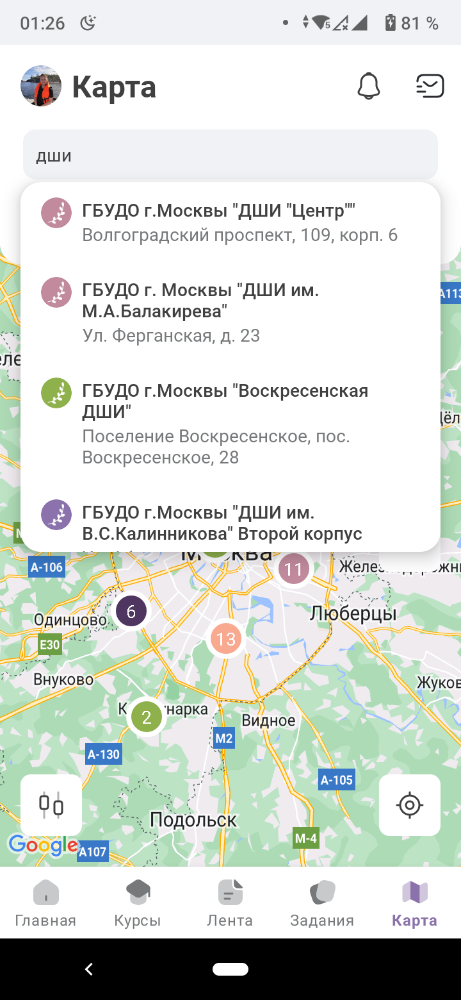  
- выберите и нажмите на точку, чтобы посмотреть информацию об учебном заведении  
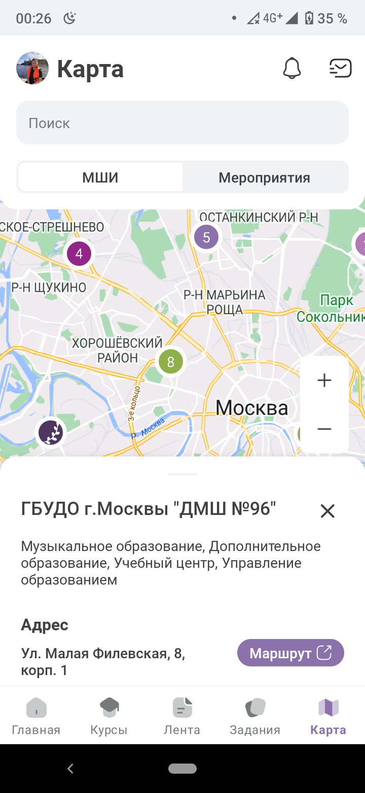 

- на карте мероприятий воспользуйтесь фильтром для поиска направлений/района или воспользуйтесь полем "поиск"  

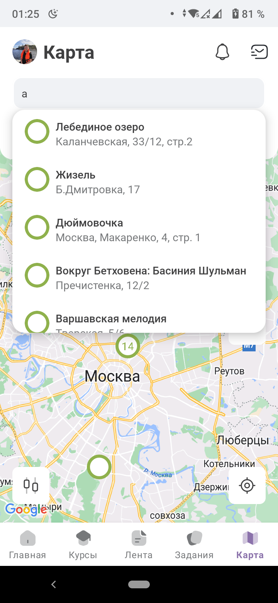  
- выберите мероприятие и прокрутите вниз для покупки билета  
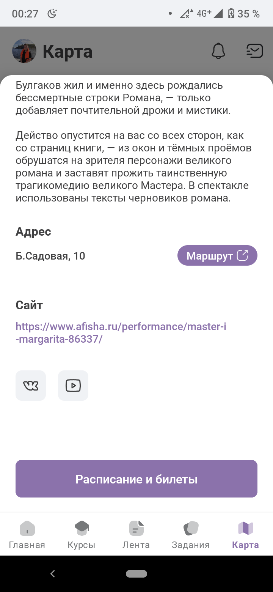  

# О приложении

[Репозиторий](https://github.com/NoTryCatchTeam/Lct2023)  

Мобильное приложение выполнено на базе [Xamatin.Native](https://dotnet.microsoft.com/en-us/apps/xamarin) для платформы Android.   
Серверная часть представлена несколькими компонентами:  
- API, на базе [.NET](https://dotnet.microsoft.com/en-us/)  
- CMS, на базе [Strapi](https://strapi.io/)  
- Сервис публикации презентаций PDF, на базе [PDFJS](https://mozilla.github.io/pdf.js/)  
- СУБД [PostgreSQL](https://www.postgresql.org/)  

