# Управление контентом
Все операции по добавлению, публикации и удалению контента выполняются в [CMS](http://45.9.27.2/admin) в разделе "Редактор контента"  
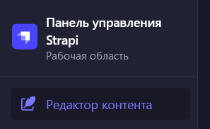

## Создание записи

- Выбрать тип коллекции, например "location"   
- Нажать кнопку "Создать новую запись"  
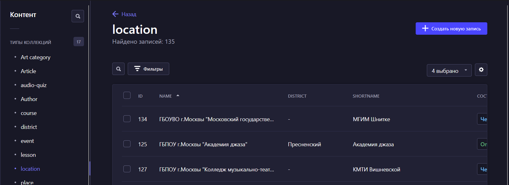  
- Заполните запись необходимыми данными (см. [Типы коллекций](./#_5))  
- Нажмите "Сохранить"  
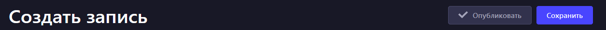  

Созданные записи не будут отображаться в мобильном приложении, если они не опубликованны.
## Публикация записи

- Выбрать сохраненную запись, которую хотите опубликовать  
- Нажать кнопку "Опубликовать"  
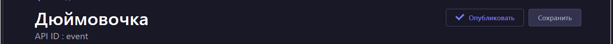  

Опубликованная запись будет отображаться в мобильном приложении  

- При желании можно отменить публикацию записи, нажав кнопку "Отменить публикацию"  
   

Запись перестанет отображаться в мобильном приложении, но будет сохранена в базе данных.  

## Удаление записи

- Выбрать сохраненную запись, которую хотите удалить  
- Удалить ее из представления коллекции, нажав иконку корзины  
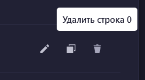   
- Или удалить ее из представления записи, нажав кнопку "Удалить эту запись"  
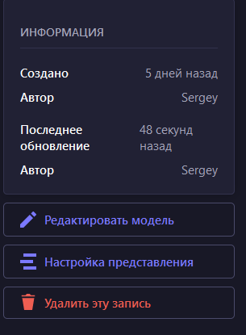    

## Добавление медиа-файлов
Добавить медиа-файлы, например видео/аудио/картинки/презентации, можно в меню Медиа-библиотека  
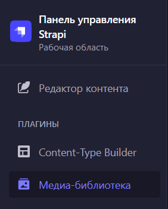    

- Нажать на кнопку "Add new assets" и перетянуть файлы в открывшееся окно, либо выбрать через "Обзор файлов"  
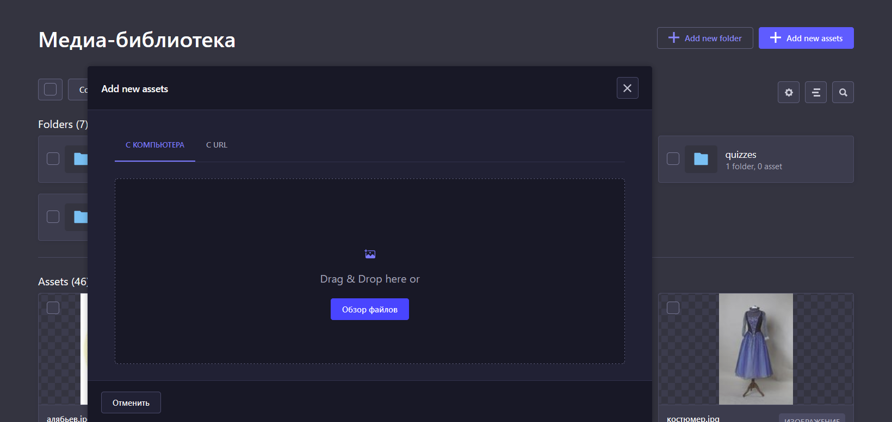    

# Типы коллекций
## Учебное заведение
Колекция "location"
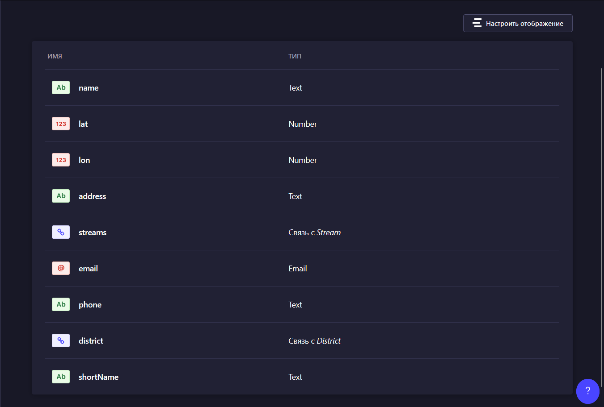    

name: Название школы (полное)  
shortName: Название школы (короткое)  
lat: Широта  
lon: Долгота  
address: Адрес  
email: Email адрес  
phone: Телефон  
district: Район  
streams: Направления обучения (программы)

## Мероприятие
Коллекция "event"
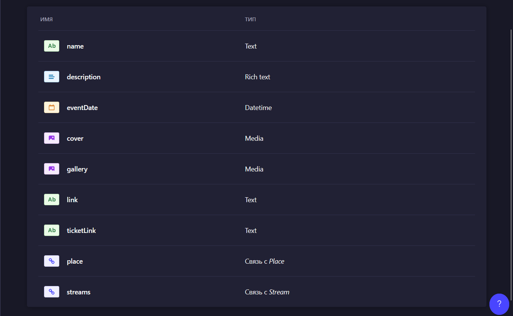    
name: Название события  
description: Описание события  
eventDate: Дата и время события  
cover: Обложка события  
gallery: Медиа галлерея события  
link: Ссылка на событие  
ticketLink: Ссылка на покупку билета  
place: Место  
streams: Направления искусств  

## Новость
Коллекция "article"
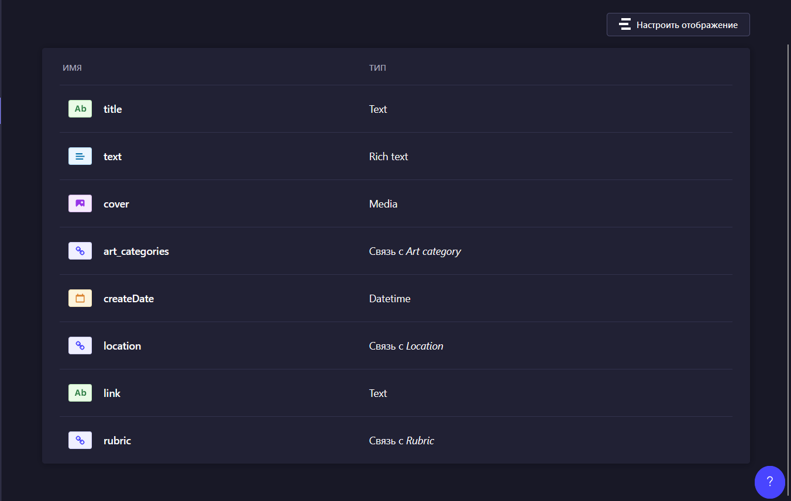  

title: Заголовок  
text: Текст новости  
cover: Обложка  
art_categories: Категории искусств  
createDate: Дата создания новости  
location: Релевантная школа искусств  
link: Ссылка на внешнюю новость  
rubric: Рубрика  

## Курс
Коллекция "course"
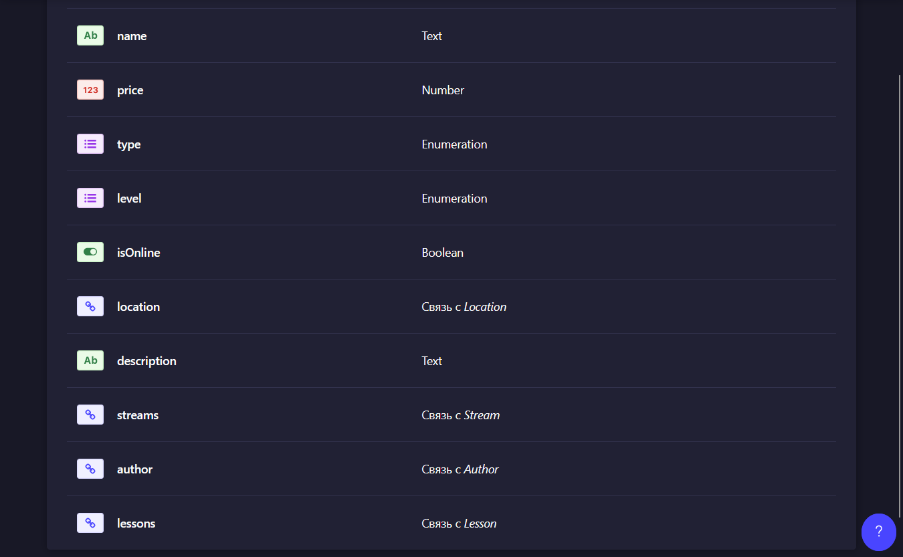  

name: Название курса  
price: Цена курса  
type: Тип курса  
level: Уровень необходимых навыков  
isOnline: Курс онлайн  
location: Место проведения обучения  
description: Описание курса  
streams: Направления искусств  
author: Автор курса  
lessons: Уроки, входящие в курс  
## Урок
Коллекция "lesson"
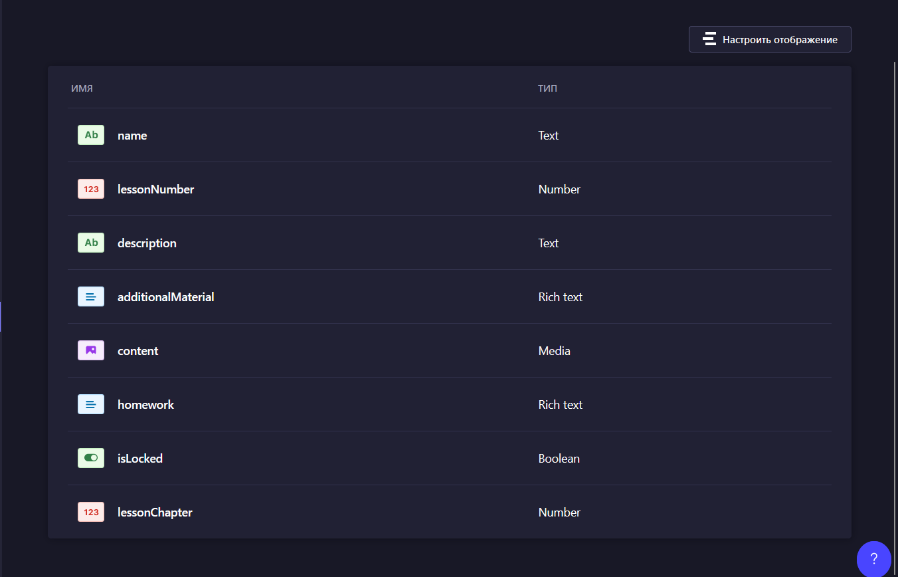  

name: Название урока  
lessonNumber: Порядковый номер урока  
description: Описание урока  
additionalMaterial: Дополнительный материал к уроку  
content: Содержание урока (видео/презентация)  
homework: Описание домашнего задания  
isLocked: Урок закрыт (по-умолчанию)  
lessonChapter: Глава урока(группировка внутри курса)    

## Автор
Коллекция "author"
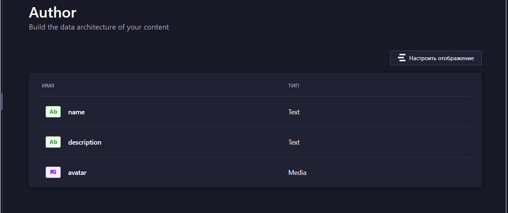  

name: Имя автора  
description: Об авторе  
avatar: Аватар

## Упражения  
### Текстовая викторина  
Коллекция "Quiz"
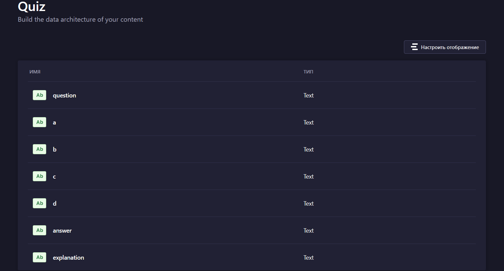  

question: вопрос  
a: первый вариант ответа  
b: второй вариант ответа  
c: третий вариант ответа  
d: четвертый вариант ответа  
answer: буква правильного ответа (a,b,c или d)  
explanation: объяснение ответа  

### Аудио викторина  
Коллекция "Audio-quiz"
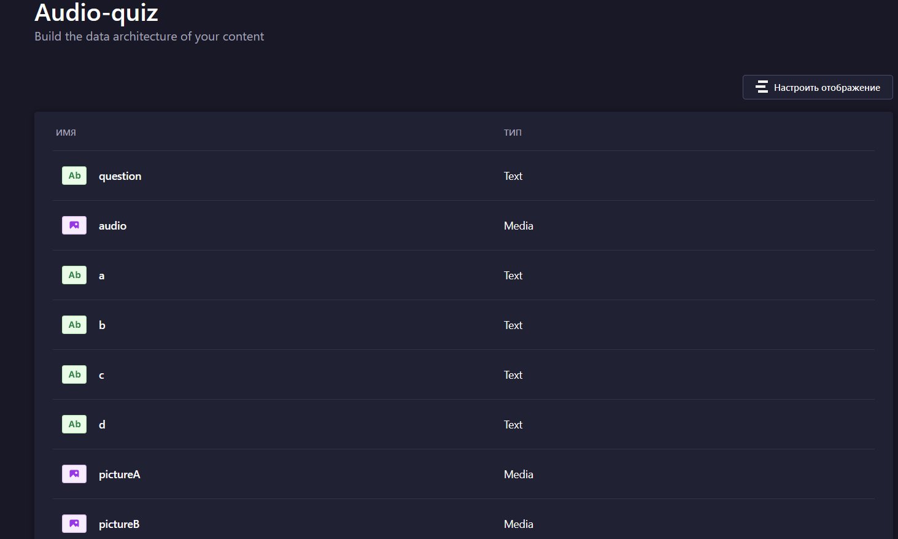  

question: вопрос  
a: первый вариант ответа  
b: второй вариант ответа  
c: третий вариант ответа  
d: четвертый вариант ответа  
pictureA: первый вариант ответа  
pictureB: второй вариант ответа  
pictureC: третий вариант ответа  
pictureD: четвертый вариант ответа  
answer: буква правильного ответа (a,b,c,d или pictureA,pictureB,pictureC,pictureD)  
explanation: объяснение ответа  

### Видео викторина  
Коллекция "Quiz"
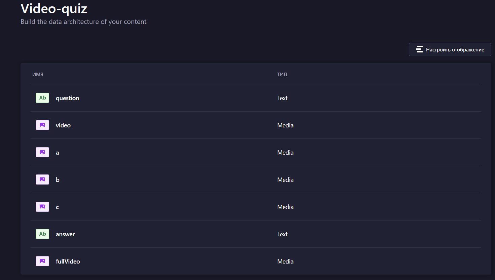  

question: вопрос    
video: видео без звука  
a: вариант ответа, первое аудио  
b: вариант ответа, второе аудио  
c: вариант ответа, третье аудио  
answer: буква правильного ответа (a,b или c)  

## Задание
Коллекция "Task"
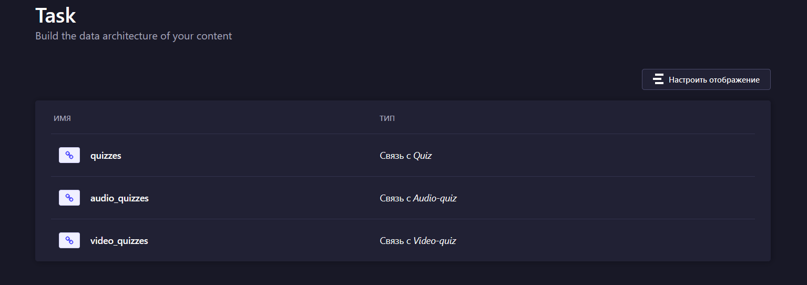  

Добавьте до 10 упражнений

quizzes: выберите викторины (вопрос-текст, ответ-текст)  
audio_quizzes: выберите аудио викторины (вопрос-аудио, ответ-текст/картинка)  
video_quizzes: выберите видео викторины (вопрос-видео, ответ-аудио)  

## Задание дня
Коллекция "daily-task"
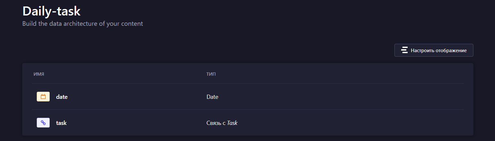  

date: Дата задания  
task: Выберите задание которое будет заданием дня в дату date  
