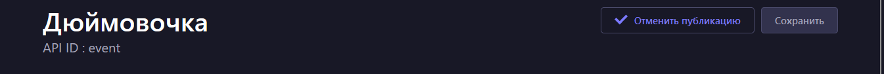

# Управление контентом
Все операции по добавлению, публикации и удалению контента выполняются в CMS в разделе "Редактор контента"  

## Создание записи

- Выбрать тип коллекции, например "location"   
- Нажать кнопку "Создать новую запись"  
  
- Заполните запись необходимыми данными (см. примеры ниже)  
- Нажмите "Сохранить"  
  

Созданные записи не будут отображаться в мобильном приложении, если они не опубликованны.
## Публикация записи

- Выбрать сохраненную запись, которую хотите опубликовать  
- Нажать кнопку "Опубликовать"  
  

Опубликованная запись будет отображаться в мобильном приложении  

- При желании можно отменить публикацию записи, нажав кнопку "Отменить публикацию"  
   

Запись перестанет отображаться в мобильном приложении, но будет сохранена в базе данных.  

## Удаление записи

- Выбрать сохраненную запись, которую хотите удалить  
- Удалить ее из представления коллекции, нажав иконку корзины  
   
- Или удалить ее из представления записи, нажав кнопку "Удалить эту запись"  
    

# Типы коллекций
## Учебное заведение

## Мероприятие

## Новость

## Курс